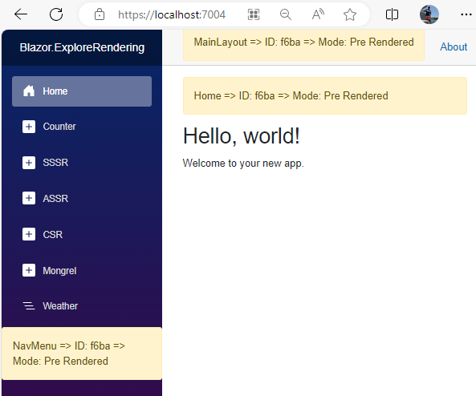
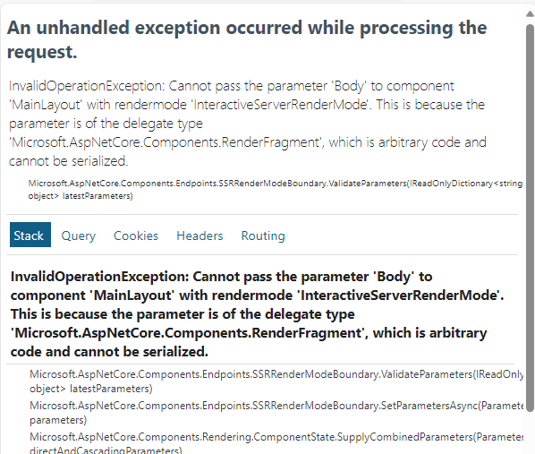

# Going For Broke

There's a honeypot in the Blazor Web App template : *InteractiveAuto* with Interactivity set for *Per Page/Component*.  Almost everyone new to Blazor goes for it. The full works, freedom to choose.  The problem is you're unaware of the consequences of that decision.  It's not your fault, it's Microsoft's, for putting the honeypot there in the first place, and for not giving it a serious government health warning. 

In this post I'll take a look at how this template option works, discuss  design and deployment issues and explain what I believe are the only two use cases for choosing this *modus operandi*.

A word on acronyms and terminology.  I'll talk about three modes of rendering:

1. **SSSR** - classic Static Server Side Rendering.
2. **ASSR** - Active Server Side Rendering.  Blazor Server.
3. **CSR** - Client Side Rendering.  Blazor WASM/Web Assembly.

I'll use these acronyms throughout the rest of this article.

## Create a Solution

Create a solution using the *Blazor Web Project* with the *AutoInteractive* and *Per Page/Component* options.

You get two projects: 

1. The Web Server/Interactive Server project.
1. The Client project containing the Web Assembly project.

Both of these are deployment projects: they create a deployable solution.


### Adding RenderState to the Solution

The *RenderState* Nuget package provides some simple infrastructure to log and display the render mode of components.  See [Blazr.RenderState Repo on GitHub](https://github.com/ShaunCurtis/Blazr.RenderState)

Add the following Nuget packages to the projects:

Web Server :

```xml
   <PackageReference Include="Blazr.RenderState.Server" Version="0.9.1" />
 ```

Client :

```xml
   <PackageReference Include="Blazr.RenderState.WASM" Version="0.9.1" />
 ```

Add the following services to the Server `Program`:

```csharp
using Blazr.RenderState.Server;
//...
builder.AddBlazrRenderStateServerServices();
```

And the following services to the Client `Program`:

```csharp
using Blazr.RenderState.WASM;
//...
builder.AddBlazrRenderStateWASMServices();
```

And add the following `using` to both project's `_Imports.razor`.

```csharp
@using Blazr.RenderState
```

## The Pages/Components

Note most of the components are in the Server project.  Only  `Counter` is in Client Project.

Add the following component to `Home`, `Counter` and `Weather` below the `Page Title` :

```csharp
@page "/"
<PageTitle>Home</PageTitle>
<RenderStateViewer Parent="this" />
//...
```

Add it to `MainLayout`:

```csharp
    <main>
        <div class="top-row px-4">
            <RenderStateViewer Parent="this" />
            <a href="https://learn.microsoft.com/aspnet/core/" target="_blank">About</a>
        </div>

        <article class="content px-4">
            @Body
        </article>
```

And to `NavMenu` along with some extra navigation links:

```csharp
<div class="top-row ps-3 navbar navbar-dark">
    <div class="container-fluid">
        <a class="navbar-brand" href="">Blazor.ExploreRendering</a>
    </div>
</div>

<input type="checkbox" title="Navigation menu" class="navbar-toggler" />

<div class="nav-scrollable" onclick="document.querySelector('.navbar-toggler').click()">
    <nav class="flex-column">
        <div class="nav-item px-3">
            <NavLink class="nav-link" href="" Match="NavLinkMatch.All">
                <span class="bi bi-house-door-fill-nav-menu" aria-hidden="true"></span> Home
            </NavLink>
        </div>

        <div class="nav-item px-3">
            <NavLink class="nav-link" href="counter">
                <span class="bi bi-plus-square-fill-nav-menu" aria-hidden="true"></span> Counter
            </NavLink>
        </div>

        <div class="nav-item px-3">
            <NavLink class="nav-link" href="sssr">
                <span class="bi bi-plus-square-fill-nav-menu" aria-hidden="true"></span> SSSR
            </NavLink>
        </div>

        <div class="nav-item px-3">
            <NavLink class="nav-link" href="assr">
                <span class="bi bi-plus-square-fill-nav-menu" aria-hidden="true"></span> ASSR
            </NavLink>
        </div>

        <div class="nav-item px-3">
            <NavLink class="nav-link" href="csr">
                <span class="bi bi-plus-square-fill-nav-menu" aria-hidden="true"></span> CSR
            </NavLink>
        </div>

        <div class="nav-item px-3">
            <NavLink class="nav-link" href="mongrel">
                <span class="bi bi-plus-square-fill-nav-menu" aria-hidden="true"></span> Mongrel
            </NavLink>
        </div>

        <div class="nav-item px-3">
            <NavLink class="nav-link" href="weather">
                <span class="bi bi-list-nested-nav-menu" aria-hidden="true"></span> Weather
            </NavLink>
        </div>
        <RenderStateViewer Parent="this" />
    </nav>
</div>
```

Create some new pages to the *Server* project:

*ASSR.razor*

```csharp
@page "/assr"
@rendermode InteractiveServer

<PageTitle>Home</PageTitle>

<RenderStateViewer Parent="this" />

<h1>Hello, world!</h1>

Welcome to your new app.
```

*SSSR.razor*

```csharp
@page "/sssr"

<PageTitle>Home</PageTitle>

<RenderStateViewer Parent="this" />

<h1>Hello, world!</h1>

Welcome to your new app.
```

*CSR.razor*

```csharp
@page "/CSR"
@rendermode InteractiveWebAssembly

<PageTitle>CSR</PageTitle>

<RenderStateViewer Parent="this" />

<h1>Hello, world!</h1>

Welcome to your new app.
```

*Mongrel.razor*

```csharp
@page "/mongrel"

<PageTitle>Home</PageTitle>

<RenderStateViewer Parent="this" />

<RenderStateViewer @rendermode="InteractiveAuto" Parent="this" />

<RenderStateViewer @rendermode="InteractiveServer" Parent="this" />

<RenderStateViewer @rendermode="InteractiveWebAssembly" Parent="this" />

<h1>Hello, world!</h1>

Welcome to your new app.
```


### Run the Solution

You see this:



`RenderStateViewer` displays three pieces of information:

```text
Parent Compoment Name => Unique ID of the Scoped Session Service => Render Mode of the Component
```

## Behaviours

Switch between components and noting the render modes and the Id's of the Scoped conponent.  You will find various combinations that confuse.  I'll look at a few and explain.

### Everything is SSSR on the Home Page

Review `App.razor`.  The two top level components have no render mode set: default is therefore SSSR.  `Routes` is rendered SSSR, so `Router` and  `Layout` are also statically rendered.

```csharp
<!DOCTYPE html>
<html lang="en">

<head>
//..
    <HeadOutlet />
</head>

<body>
    <Routes />
    <script src="_framework/blazor.web.js"></script>
</body>

</html>
```

### Everything causes a full page refresh

`App`, `Route`, `Router`, `MainLayout` are all SSSR as described above.  The router runs on the server so it can make the correct render mode decision.

It's interesting to note that although you make a trip to the server to route between two client side pages, CSR => Counter for example, the client side Blazor session is maintained.  The same is the case with the server Hub sessions.

### Different Components have different Scoped Session instances

Go to *Mongrel* and note the different Service Id's.

 - *Pre-Rendered* SSSR components all have the same ID.  This is the scoped service created for the lifetime of the Http Request.  Every page request creates a new *Scoped* container and *Scoped* services.
  
 - The SSR service is alive in the Blazor Hub session running on the server.  It's lifetime is scoped to the SPA session.  All SSSR components share this service instance.
  
 - The CSR service is alive in the Blazor SPA session running in the Web Assembly container on the Browser.  It's a different instance from the SSR instance.

 - The Auto component has rendered in CSR mode, so has the CST service instance.

Consider how this complicates application design.  How does a ASSR render component and a CSR component use the same notification service?  How do they share data?

SSSR and ASSR share the same *Singleton* service, but ASSR and CSR have different instances.  They are totally separate applications.

Blazor does provide a mechanism for passing pre-render data to active components, but doesn't help much.

### InteractiveAuto Pages don't always render in the same mode

Go to *Home* and then to *Counter*.  *Counter* renders in CSR mode with the CSR service instance.

Now go to *ASSR* and then back to *Counter*.  It's now rendered in ASSR mode, and uses the Blazor Hub service instance.

Consider saving the state of the counter in a service.  You get different states depending on the render mode.

### I can't set the RenderMode on Layouts

`Layouts` would be a great place to set the render mode for a group of pages.

Set the Render mode on the `MainLayout` or `RouteView`.

You will get the following rather confusing runtime exception:



You either set it at the top in `App` or individually on the pages or lower level components.

But why not?

You can't set the rendermode on a component that defines one or more `RenderFragment` Parameters.  *Layouts* define `Body`.  In most cases it's `ChildContent`.

Consider this simple case:

```csharp
\\no render mode set so inherits SSSR

<MyDiv @rendermode="InteractiveServer">
    @_helloWorld
</MyDiv>
@code
{
    private string _helloWorld = "Hello Blazor";
}
```

`@_helloWorld` is a render fragment owned by the parent and passed to `MyDiv` as the `ChildContent` Parameter.  The parent is statically rendered so it tries to serialize the data it sends to the child component.   A `RenderFragment` is a  `delegate` which can't be serialized, so Bang!

## This isn't a Single Page Application

Blazor was conceived as a Single Page Application, running either in a Server Hub environment or in a Web Assembly environment in the Browser.  An intial Http request trip to the server to get the page, a few side trips to get resources.  Run some JS and the application is up and running in the browser: no more Http requests.

This hybrid isn't that.  The Router runs on the server.  Every page request is a Http request to the server.  The layout is statically rendered.

Basically a static server rendered application with a JS front end.  I hesitate to say this but: What Microsoft have been trying to deliver for it's Asp.Net, Razor, MVC customer base for years!

If you want old Blazor [seems quite a strange statement to make for a new technology], choose one of the pure modes with `Global` interactivity.

## More to Come

I'll add some more detail as I discover new wrinkles.

## My Personal Initial Conclusions and Observations

> Note these are personal views and opinions.

My gut feeling is that using **Per Page/Component** mode isn't hybrid, it's a mongrel.

Most who came to old Blazor struggled with the component concept and were confused with the lifecycle and events.  Throwing in render modes adds another level of complexity. I can see so many scenarios where components are talking to the wrong instances or types of services.  Throw `Auto` to the mix and the complexity spirals [out of control].  Think of the exotic concoctions and black holes people will come up!

My recommendation is go with either *Interactive Server* or *Interactive WebAssembly* and *Global* application.

I see only two use cases for the `InteractiveAuto` and `Per page/component` deployment:

1. You're coming from a classic server side rendered application that has been migrated to Net8.0 and you want a phased migration to Blazor.
   
2. You want freedom to choose but don't have the knowledge to know how bad that decision will turn out.

Hopefully I've disuaded you from choosing the second option.  The design will be complex. You will spend a lot of time debugging.  You will find yourself in some very deep dark holes. 


